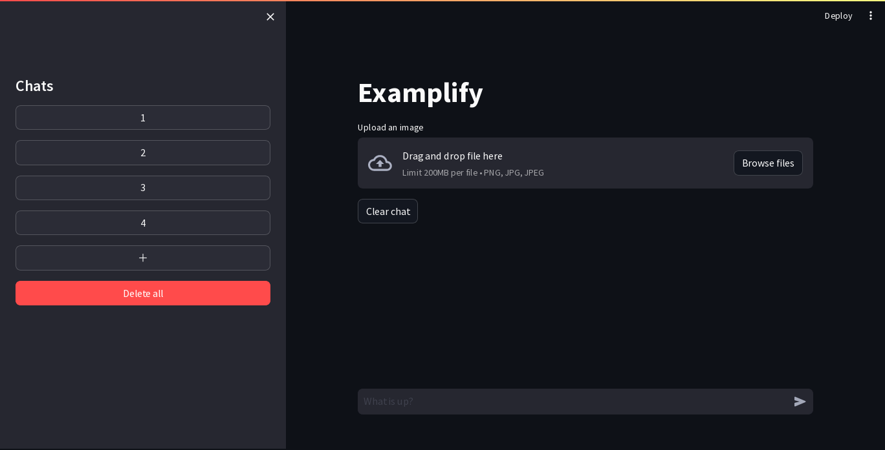

# simple-chat-ui

[](https://github.com/PyCQA/pylint)
[](https://github.com/winstxnhdw/Examplify/actions/workflows/main.yml)
[](https://github.com/winstxnhdw/Examplify/actions/workflows/formatter.yml)
[](https://github.com/winstxnhdw/Examplify/actions/workflows/dependabot.yml)

A simple chat UI for [Examplify](https://github.com/winstxnhdw/Examplify), built reluctantly with [Streamlit](https://streamlit.io/) 🤮.

<div align="center">
    
</div>

## Installation

```bash
poetry install
```

## Usage

```bash
streamlit run main.py
```
